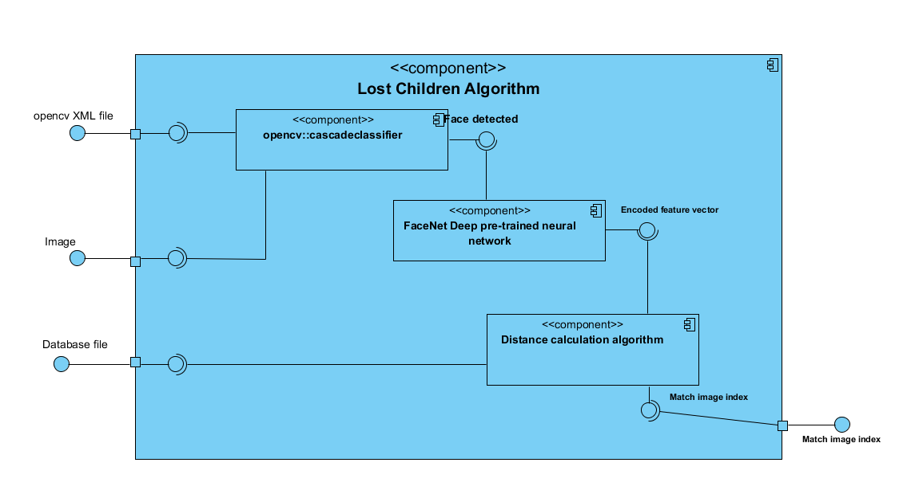

# Lost children finding application

## Team members

Name | Section | ID
--- | ---| ---
عبد الرحمن محمد عبد الحميد البحيري| 2 | `1300759`
 يمان محمد سهيل ابو اليمن|3 | `13W0029`
اٍسلام محمد مصطفي حسن | 1 |`1300277`
عمر عبد الحكيم عبد الفتاح | 2 | `1300846`

## Project Idea

The project aims to enhance the process of searching for lost people; such that an image for the lost person is uploaded and will be compared against the images stored in the database using an efficient algorithm which is explained in the algorithm section.

## Algorithm summary

The figure above shows an abstracted component diagram of all the algorithms we are using. 

### Used algorithms
+ `opencv::CascadeClassifier` for extracting face from a given image
+ Trained `FaceNet` deep neural network for obtaining the encoded face feature vector
+ A distance calculation algorithm for determining which faces in the database have their feature vector close to the current detected image

### Steps for execution
1. Using opencv face detection algorithm, extract all the faces within an image
2. Apply the neural network pre-processing operations
    + This includes scaling, pre-whitening, normalization,...
3. For the extracted faces, infer the neural network to obtain the encoded face $R^{128}$ feature vector
4. For the database feature vectors, get the faces with the smallest distance from the last obtained face feature vector

## Notes
The algorithm **Does not need to re-train** the neural network every time a user inserts a new image, the neural network is already trained to extract the facial features. We only need to calculate the distance among all the vectors stored in our database. Though this might seem in-efficient in case the database have large number we purpose a method that could be applied for a large scale application; such that

+ Same steps as the current algorithms until the neural network inference
+ Once the network outputs the face feature vectors, a Kmeans clustering algorithm will be used to determine to which cluster center this feature vector belongs to
+ Then using a database query we can filter the face vector whose distance from the cluster center is almost equal the current feature vector distance and who also belong to the same cluster. In such case the calculation of distance among all the items in the database is not needed