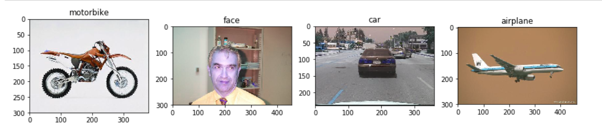

# Image Processing Assignment 2
## Name: Abdelrahman Mohamed Abdelhamid Ali Elbehery
## Section : 2
## ID : 1300759

## Table of contents
<!-- TOC -->


- [How to use](#how-to-use)
- [Algorithm details](#algorithm-details)
    - [Feature extraction and dataset building](#feature-extraction-and-dataset-building)
    - [Clustering and obtaining the bag of features](#clustering-and-obtaining-the-bag-of-features)
    - [Machine learning classifier](#machine-learning-classifier)
    - [Inference](#inference)
- [Results](#results)

<!-- /TOC -->
## How to use
+ You need a `python 3.x interpreter`
+ Dataset directory must be given when constructing the classifier object
    + Once trained you can use the helper method `save_model`
    + In case you already have a trained model, the method `load_model` can be used by giving it the `.pkl` file

## Algorithm details

### Feature extraction and dataset building

The algorithm relies heavly on the `opencv` Oriented FAST and Rotated BRIEF feature detection algorithm. The following steps are applied **for each** image in the dataset

1. Read the image and extract its descriptors using the ORB algorithm
2. The obtained descriptors are appended to a list of the same class descriptors.
    + Each class to be classified exist in a dictionary where keys are the class name and values are python lists with all the descriptors detected. E.g. `{"cars": [descritor1, descriotor2]}`

Once this step is done we end up with all the words/features of all the images in the data-set. The next step is to cluster them into a set of known features.

### Clustering and obtaining the bag of features

This is the part where all the common features are grouped together using a clustering algorithm. The code uses the `sklearn.cluster.KMeans` as the clustering algorithm. The number of clusters `K` is a hyper-parameter

### Machine learning classifier

Once the representatives of the features are collected [the cluster centers], dataset for the classifier is built as in the following steps **for each class**

1. For each descriptor, using the KMeans trained algorithm, find to which cluster this descriptor belongs
2. Label this class with the proper class ID and append it to the dataset array.

Once this step is done, the dataset is normalized and is fed to the `SVM` classifier.

At this point we have a working model that can do n-class image classification.

### Inference

Whenever the trained model is asked to classify an image, the following steps are applied

1. Get the image descriptors using the `ORB` algorithm
2. Feed these to the trained Kmeans to obtain the frequency of the centers in this image
3. Feed the obtained data to the SVM trained classifier to detect which class this image belongs


## Results

The model is trained over the dataset from [Caltech Vision Group](http://www.vision.caltech.edu/archive.html) which contain four different training classes
+ Faces
+ Motorbikes
+ Planes
+ Cars

Once trained it was tested against few images taken from the dataset. **Note** this trained model is in the repository file `model_1.pkl`

```python
trained_model = load_model("model_1.pkl")
# For readability
read = cv2.imread
test_images  = [read("data_set/motorbikes_test/img004.jpg"),
                read("data_set/faces_test/img021.jpg"),
                read("data_set/cars_test/img011.jpg"),
                read("data_set/airplanes_test/img031.jpg")]
lables = ['car', 'face', 'motorbike', 'airplane']
results = []
for i in test_images:
    results.append(lables[int(trained_model.predict(i, verbose=False))])
show(test_images[], results[], bin_img=False)
```

